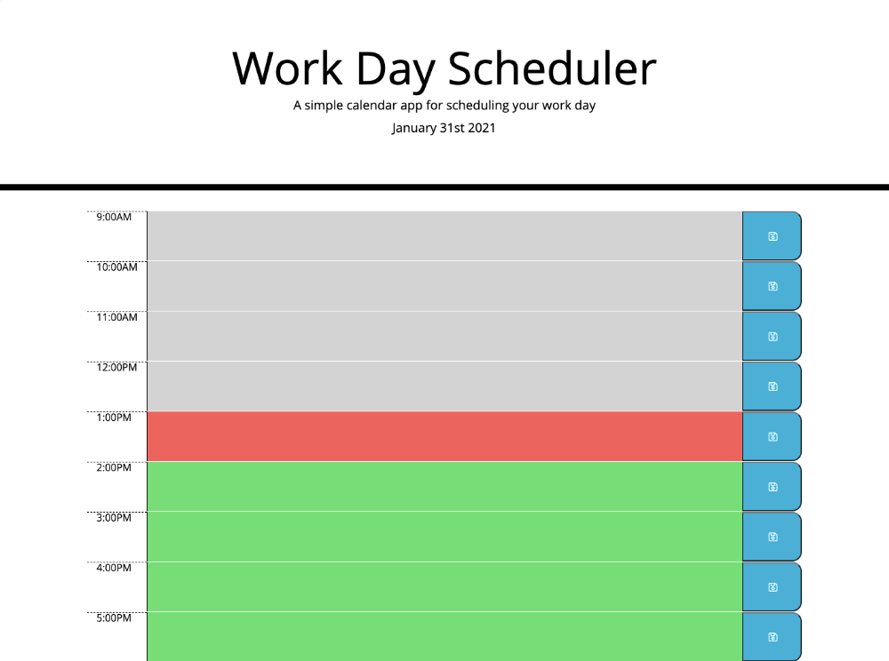
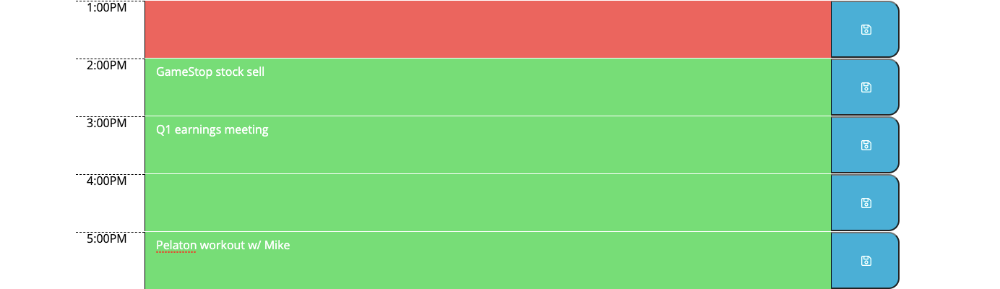

# Work-Day-Scheduler

# Description

This project presents the user with a daily work scheduler, enabling them to create and save notes in specific timeslots. This project features Moment.Js, which in a Javascript library which helps is parsing, validating, manipulating and displaying date/time in JavaScript. 

The main challenge with this project was with matching each timeblock to an actual moment in time so that the scheduler would accurately reflect past, present, and future entries. 

## Table of Contents
 * [Installation](#Installation) 
 * [Usage](#Usage)
 * [Credits](#Credits)
 * [License](#License)

## Installation

1. visit https://momentjs.com/ 
2. https://jquery.com/

## Usage
*  Main Page

*  Note Entries

## Credits
1. https://www.tutorialspoint.com/javascript/index.htm
2. https://www.w3schools.com
3. https://momentjs.com/guides/
4. https://jquery.com/

## License
...